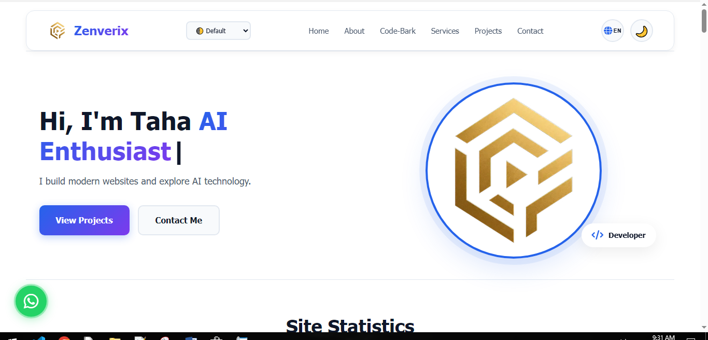

# 🚀 Zenverix

### **Build Beyond Limits**

> **Learn • Build • Grow**

Zenverix is a futuristic web experience focused on **technology, creativity, learning, and modern digital experiences**.

It combines modern frontend development with immersive UI design, smooth animations, responsive layouts, and a space-inspired visual identity.

<p align="center">
  <strong>🌌 Explore. Create. Build Beyond Limits.</strong>
</p>

---

## 🌐 Live Demo

🚀 **[Visit Zenverix](https://tahapayandeh1369-arch.github.io/Zenverix/)**

---

## ✨ Features

### 🎨 Modern Interface

* 🌌 Futuristic dark UI
* 💎 Glassmorphism design
* ✨ Smooth animations and transitions
* 🔮 Glowing visual effects
* 🎨 Modern gradients
* 🖥️ Clean and immersive interface

### 📱 Responsive Design

* 💻 Desktop optimized
* 📱 Mobile responsive
* 📟 Tablet friendly
* 🔄 Adaptive layouts and navigation

### 🪐 Interactive Experience

* 🌌 Space-inspired sections
* 🪐 Interactive visual elements
* 🖱️ Mouse-based interactions
* ✨ Animated components
* 🌊 Smooth scrolling experience

### ⚡ Frontend Performance

* Lightweight architecture
* Vanilla JavaScript
* No frontend framework dependency
* CSS-based animations
* Optimized for a smooth browsing experience

---

## 🛠️ Built With

| Technology           | Purpose                         |
| -------------------- | ------------------------------- |
| 🟧 HTML5             | Semantic structure              |
| 🎨 CSS3              | Styling, layout & animations    |
| 🟨 JavaScript        | Interactions & dynamic behavior |
| 📱 Responsive Design | Mobile & tablet compatibility   |
| ✨ CSS Animations     | Visual effects & transitions    |

---

## 🎯 Project Goals

Zenverix is a practical project for exploring modern frontend development and creating a unique digital experience.

### Main Goals

* 🚀 Improve frontend development skills
* 🎨 Explore modern UI/UX design
* 🧠 Practice JavaScript interactions
* 📱 Build responsive web experiences
* ✨ Experiment with animations
* 🌌 Create immersive interfaces
* 💡 Turn ideas into real-world projects

---

## 📸 Preview

> Screenshots will be added as the project evolves.

### 🖥️ Desktop



### 📱 Mobile


---

## 📂 Project Structure

```text
Zenverix/
│
├── 📄 index.html
├── 🎨 style.css
├── 🟨 script.js
│
├── 📁 assets/
│   ├── 📁 images/
│   ├── 📁 icons/
│   └── 📁 fonts/
│
├── 📁 screenshots/
│   ├── desktop.png
│   └── mobile.png
│
└── 📄 README.md
```

---

## 🚀 Getting Started

### 1. Clone the repository

```bash
git clone https://github.com/tahapayandeh1369-arch/Zenverix.git
```

### 2. Open the project

```bash
cd Zenverix
```

### 3. Run locally

Open `index.html` in your browser.

For development, **VS Code + Live Server** is recommended.

---

## 🗺️ Roadmap

* [x] 🌐 Deploy website with GitHub Pages
* [x] 📱 Responsive layout
* [x] 🎨 Futuristic UI
* [x] ✨ Animations and visual effects
* [ ] 🪐 Expand interactive space elements
* [ ] 🌍 Add World Time experience
* [ ] 🤖 Explore AI-powered features
* [ ] 📚 Expand learning-focused sections
* [ ] ⚡ Further performance optimization
* [ ] 🔐 Explore backend & API integration

---

## 📌 Project Status

🟢 **Active Development**

Zenverix is continuously evolving with new features, design improvements, experiments, and optimizations.

---

## 👨‍💻 Author

### Taha

**Developer • Creator • Learner**

Interested in:

`Web Development` • `JavaScript` • `Python` • `AI` • `Technology`

---

## ⭐ Support

If you like **Zenverix**, consider giving the repository a ⭐ **Star**.

Your support helps motivate continued development and future improvements.

---

<p align="center">

### 🚀 Zenverix

**Build Beyond Limits**

`Code • Think • Create • Grow`

</p>
